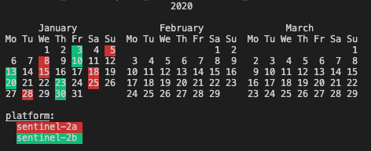

Quickstart
----------

pystac-client can be used as either a Command Line Interface (CLI) or a
Python library.

CLI
~~~

Use the CLI to quickly make searches and output or save the results.

The ``--matched`` switch performs a search with limit=1 so does not get
any Items, but gets the total number of matches which will be output to
the screen (if supported by the STAC API).

.. code-block:: console

    $ stac-client search https://earth-search.aws.element84.com/v0 -c sentinel-s2-l2a-cogs --bbox -72.5 40.5 -72 41 --matched
    2179 items matched

If the same URL is to be used over and over, define an environment
variable to be used in the CLI call:

.. code-block:: console

    $ export STAC_API_URL=https://earth-search.aws.element84.com/v0
    $ stac-client search ${STAC_API_URL} -c sentinel-s2-l2a-cogs --bbox -72.5 40.5 -72 41 --datetime 2020-01-01/2020-01-31 --matched
    48 items matched

Without the ``--matched`` switch, all items will be fetched, paginating
if necessary. If the ``--max-items`` switch is provided it will stop
paging once that many items has been retrieved. It then prints all items
to stdout as an ItemCollection. This can be useful to pipe output to
another process such as
`stac-terminal <https://github.com/stac-utils/stac-terminal>`__,
`geojsonio-cli <https://github.com/mapbox/geojsonio-cli>`__, or
`jq <https://stedolan.github.io/jq/>`__.

.. code-block:: console

    $ stac-client search ${STAC_API_URL} -c sentinel-s2-l2a-cogs --bbox -72.5 40.5 -72 41 --datetime 2020-01-01/2020-01-31 | stacterm cal --label platform

If the ``--save`` switch is provided instead, the results will not be
output to stdout, but instead will be saved to the specified file.

.. code-block:: console

    $ stac-client search ${STAC_API_URL} -c sentinel-s2-l2a-cogs --bbox -72.5 40.5 -72 41 --datetime 2020-01-01/2020-01-31 --save items.json

If the Catalog supports the `Query
extension <https://github.com/radiantearth/stac-api-spec/tree/master/fragments/query>`__,
any Item property can also be included in the search. Rather than
requiring the JSON syntax the Query extension uses, pystac-client uses a
simpler syntax that it will translate to the JSON equivalent. Note
however that when the simple syntax is used it sends all property values
to the server as strings, except for ``gsd`` which it casts to
``float``. This means that if there are extensions in use with numeric
properties these will be sent as strings. Some servers may automatically
cast this to the appropriate data type, others may not.

The query filter will also accept complete JSON as per the specification.

::

    <property><operator><value>

    where operator is one of `>=`, `<=`, `>`, `<`, `=`

    Examples:
    eo:cloud_cover<10
    created=2021-01-06
    view:sun_elevation<20

Any number of properties can be included, and each can be included more
than once to use additional operators.

.. code-block:: console

    $ stac-client search ${STAC_API_URL} -c sentinel-s2-l2a-cogs --bbox -72.5 40.5 -72 41 --datetime 2020-01-01/2020-01-31 -q "eo:cloud_cover<10" --matched
    10 items matched

.. code-block:: console

    $ stac-client search ${STAC_API_URL} -c sentinel-s2-l2a-cogs --bbox -72.5 40.5 -72 41 --datetime 2020-01-01/2020-01-31 -q "eo:cloud_cover<10" "eo:cloud_cover>5" --matched
    4 items matched

Python
~~~~~~

To use the Python library, first a Client instance is created for a
specific STAC API (use the root URL):

.. code-block:: python

    from pystac_client import Client

    client = Client.open("https://earth-search.aws.element84.com/v0")

Create a search:

.. code-block:: python

    my_search = client.search(
        max_items=10,
        collections=['sentinel-s2-l2a-cogs'],
        bbox=[-72.5,40.5,-72,41])
    print(f"{mysearch.matched()} items found")

The ``items()`` iterator method can be used to iterate through all resulting items.

.. code-block:: python

    for item in my_search.items():
        print(item.id)

To convert all of Items from a search as a single `PySTAC
ItemCollection <https://pystac.readthedocs.io/en/latest/api/pystac.html#pystac.ItemCollection>`__,
you must first do a limited iteration on the iterator to get a list of Items, and then
create an ItemCollection with that. The ``ItemCollection`` can then be saved as a
GeoJSON FeatureCollection.

Save all found items as a single FeatureCollection:

.. code-block:: python

    from pystac import ItemCollection

    my_itemcollection = ItemCollection(items = list(my_search.items()))
    my_itemcollection.save_object('my_itemcollection.json')
